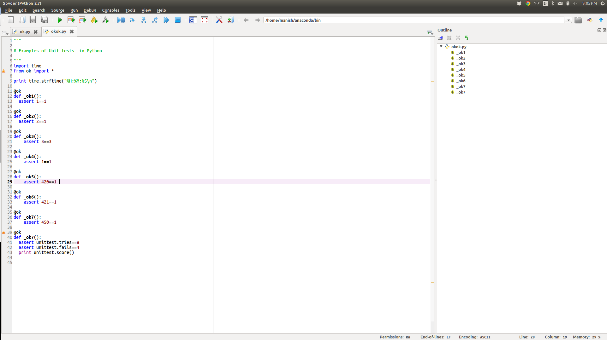
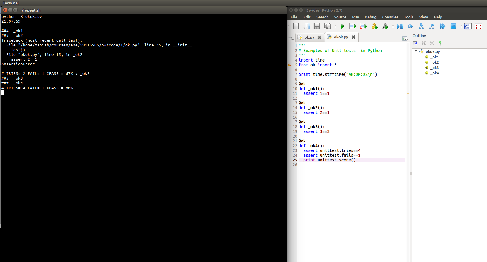
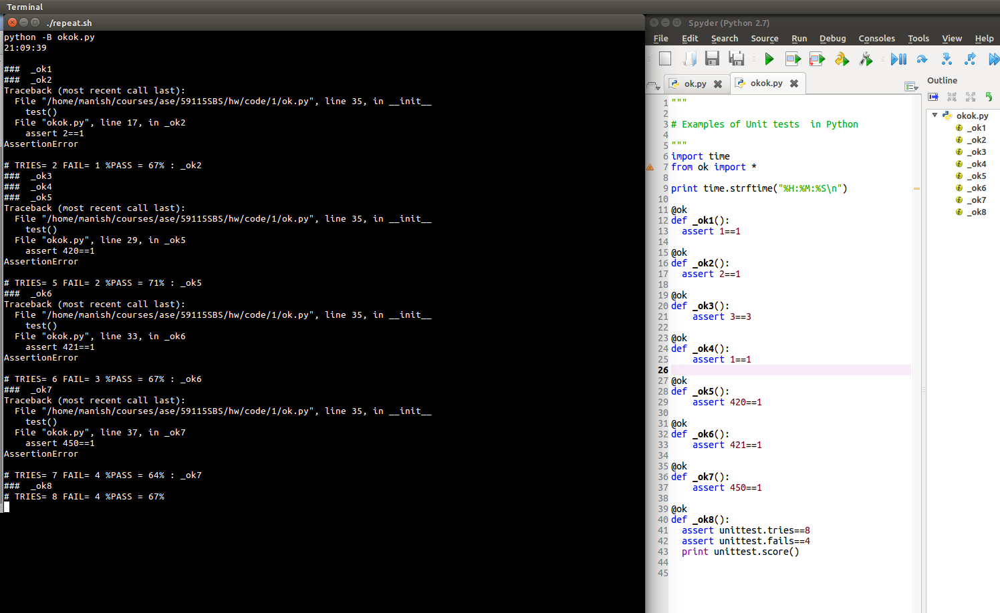

#====================================================================
#Homework: 1
#Date	 : 19-Aug-2015
#Details : This is the first homework for Automated SE course
#Author  : Manish Singh
#====================================================================

1. To run the program, execute -> rerun "python -B okok.py" in the shell
2. Screen snap of the top level of repository
	
5. Screenshot of the Python IDE. (I am using Spyder IDE by Anaconda)
	
6. Screenshot of output of okok.py test with four test cases
	
7. Screenshot of output of okok.py test with eight test cases
	

